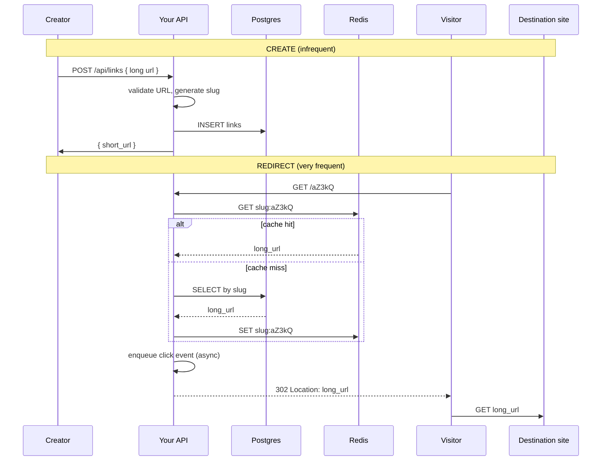

# How a URL Shortener Works — From First Principles

> A beginner-friendly guide. No prior backend knowledge assumed.
> This document explains the *idea* before you touch the Rust code in this project.

---

## 1. The problem in one sentence

Long URLs are awkward to share, easy to break when copied, and hard to track.
A **URL shortener** turns a long link into a **short code** (a *slug*) that your
server remembers — so when someone visits the short link, your server sends them
to the original long URL.

**Analogy:** Think of a hotel concierge desk. You give them a long, complicated
direction ("Building C, floor 7, room 704, use the side entrance…"). They hand
you a room key labeled **`704`**. Anyone with that key gets sent to the right place.
The key is short; the full address lives in the hotel's records.

---

## 2. The two core operations

Every URL shortener does exactly two things:

| Operation | Who uses it | What happens |
|-----------|-------------|--------------|
| **Create** | App owner / API client | Submit a long URL → get back a short URL |
| **Redirect** | Anyone with the link | Visit short URL → browser ends up at the long URL |

That's it. Analytics, auth, caching, and scaling are *add-ons* around these two flows.

---

## 3. Create: turning a long URL into a short one

### Step by step

1. **Client sends a long URL**  
   Example: `POST /api/links` with body `{ "url": "https://example.com/blog/2024/very-long-article-title" }`

2. **Server validates the URL**  
   - Must be a real web URL (`https://…`), not garbage or dangerous schemes (`javascript:…`)
   - Not too long, not pointing at internal networks (security — more below)

3. **Server generates a unique short code (slug)**  
   Example slug: `aZ3kQ`  
   This is the "room key" — it must be unique across all links in the system.

4. **Server saves the mapping in a database**

   | slug   | long_url                                      |
   |--------|-----------------------------------------------|
   | aZ3kQ  | https://example.com/blog/2024/very-long-…     |

5. **Server responds** with something like:

   ```json
   {
     "slug": "aZ3kQ",
     "short_url": "https://short.example/aZ3kQ",
     "long_url": "https://example.com/blog/2024/very-long-article-title"
   }
   ```

The client can now share `https://short.example/aZ3kQ` instead of the long URL.

### Where does the slug come from?

**Naive approach:** Use the database row number (`1`, `2`, `3`…) and encode it in
base62 → `1` → `b`, `62` → `10`, etc. Simple, but the database becomes a bottleneck
when many servers create links at once (they all fight over the same counter).

**Better at scale:** Generate IDs **in the application** without asking the database
for the next number (Snowflake-style IDs in this project's V1 challenge). Each app
instance gets a worker ID; IDs are time-ordered and unique without coordination.

**Vanity slugs (optional):** Let users pick `my-brand` instead of random `aZ3kQ`.
You must check the slug isn't already taken (collision detection).

---

## 4. Redirect: what happens when someone clicks the short link

This is the **hot path** — it runs far more often than "create link."

### Step by step

1. **User's browser** requests: `GET https://short.example/aZ3kQ`

2. **Your server** looks up `aZ3kQ` and finds the long URL.

3. **Your server responds with an HTTP redirect**, not the article itself:

   ```
   HTTP/1.1 302 Found
   Location: https://example.com/blog/2024/very-long-article-title
   ```

4. **Browser automatically follows** `Location` and loads the real page.

### 301 vs 302 — why it matters

Both tell the browser "go somewhere else." The difference is **caching behavior**:

| Code | Name | Browser behavior | Typical use |
|------|------|------------------|-------------|
| **301** | Moved Permanently | May cache the redirect forever; future clicks might skip your server | Stable links; SEO "this URL moved permanently" |
| **302** | Found (temporary) | Usually re-checks your server each time | You want every click to hit you (for analytics) |

For a shortener that **counts clicks**, **302** (or **307**) is often preferred so
every visit is recorded. **301** can mean some clicks never reach you again because
the browser cached the redirect.

### What the user actually sees

```
User clicks:  short.example/aZ3kQ
                    │
                    ▼
              Your server  ──redirect──▶  example.com/long-page
                    │
              (optional: record click)
```

The redirect is usually **fast** (milliseconds). Users shouldn't wait on a slow
database write for analytics — that's why this project separates "redirect" from
"record click" (V3).

---

## 5. What's stored (the data model)

At minimum you need one table — **links**:

```
links
├── id          (unique internal id, e.g. Snowflake number)
├── slug        (public short code, e.g. "aZ3kQ")
├── long_url    (the destination)
└── created_at  (when the link was created)
```

For **analytics**, you add **click events** (one row per click, or approximations):

```
click_events
├── link_id     (which link was clicked)
├── occurred_at (when)
├── referer     (where the user came from, if sent)
├── user_agent  (browser/device hint)
└── ip_hash     (privacy-safe visitor hint, not raw IP)
```

In this project's migration (`migrations/0001_init.sql`), that's exactly the shape.

---

## 6. Why "hello world" becomes hard at scale

A toy shortener: one server, one database, every redirect hits Postgres. Works fine
for 10 users.

Real traffic looks different:

| Pattern | Why it hurts |
|---------|----------------|
| **Read-heavy** | One link created → millions of redirects. Lookups dominate writes. |
| **Viral links** | One slug suddenly gets 100k requests/second. DB melts without cache. |
| **Many servers** | Creating IDs with `SERIAL` in Postgres = single bottleneck. |
| **Analytics** | Writing one DB row per click on the redirect path = slow redirects. |

So production shorteners add:

1. **Fast lookup cache** (Redis) — V2 in this project  
2. **Coordination-free IDs** — V1  
3. **Async click logging** — V3  

---

## 7. Caching (why Redis exists here)

**Without cache:** every redirect = Postgres query.

**With cache-aside:**

```
Redirect request for slug "aZ3kQ"
        │
        ▼
   Check Redis ──hit──▶ return long_url (fast!)
        │
       miss
        │
        ▼
   Query Postgres ──found──▶ store in Redis ──▶ return long_url
        │
      not found
        │
        ▼
   Cache "doesn't exist" too (negative cache) ──▶ 404
```

**Cache stampede:** A hot key expires; 10,000 requests all miss at once and hammer
Postgres. Fix: only **one** request rebuilds the cache; others wait or use slightly
stale data (single-flight / locking).

---

## 8. Analytics without slowing redirects

**Bad design:**

```
redirect handler:
  1. look up URL
  2. INSERT click into database  ← user waits for this
  3. return redirect
```

**Good design (this project's V3):**

```
redirect handler:
  1. look up URL
  2. drop click event into a channel (non-blocking, microseconds)
  3. return redirect immediately

background task:
  batch thousands of clicks
  bulk INSERT every 500ms
```

If clicks flood in faster than the DB can write, the channel fills up. You must
decide: drop analytics? block? shed load? That's **backpressure**.

---

## 9. Security basics (not optional)

| Threat | What to do |
|--------|------------|
| Anyone creating links | Require **API key** on `POST /api/links` |
| `javascript:alert(1)` URLs | Validate scheme allowlist (`https` only) |
| Shortener used to scan internal networks | Block private IPs / SSRF |
| Stolen API keys in logs | Never log secrets; compare keys in constant time |
| SQL injection | Use parameterized queries (`sqlx::query!`, not string concat) |
| Abuse / spam | Rate limit link creation per API key |

Redirects stay **public** (no API key) — that's the point. Writes and stats are protected.

---

## 10. How this maps to *your* project

File layout and responsibility:

| File / piece | Role |
|--------------|------|
| `routes.rs` | HTTP: create link, redirect, stats |
| `id_gen.rs` | V1 — generate unique slugs without DB sequences |
| `cache.rs` | V2 — Redis cache-aside + stampede protection |
| `main.rs` (ingest) | V3 — background batch writer for clicks |
| `auth.rs` | API key middleware on protected routes |
| `migrations/` | Postgres schema for `links` + `click_events` |
| Redis + Postgres | Started via `docker compose up -d` |

Suggested build order (from `SPEC.md`):

1. **Boring path first** — create + redirect straight to Postgres (no cache, no analytics).
2. **V1** — Snowflake IDs → base62 slug.
3. **V2** — Redis cache, then stampede protection.
4. **V3** — async click ingestion.
5. **Security** — validation, auth, rate limits.
6. **Benchmark** — prove cache helps under load.

---

## 11. End-to-end diagram



---

## 12. Glossary

| Term | Meaning |
|------|---------|
| **Slug** | The short path segment (`aZ3kQ`) |
| **Long URL** | Original destination |
| **Redirect** | HTTP response telling the browser to go elsewhere |
| **Hot path** | Code that runs on every redirect — must be fast |
| **Cache-aside** | App checks cache first; on miss, loads from DB and fills cache |
| **Negative cache** | Remembering "this slug doesn't exist" to avoid repeated DB misses |
| **Backpressure** | What you do when a queue (click events) is full |
| **SSRF** | Attacker uses your server to request internal URLs |

---

## 13. Mental model checklist

Before writing code, you should be able to answer:

1. What two HTTP endpoints are the heart of the product?
2. Why is redirect traffic harder than create traffic?
3. What does the browser do when it receives a `302` with a `Location` header?
4. Why shouldn't click logging block the redirect?
5. Why might you use Redis in front of Postgres?
6. What's the difference between a **301** and **302** for your analytics?

If those feel clear, you're ready to implement the `todo!()` handlers in `routes.rs`
one layer at a time — starting with the boring Postgres-only path.

---

## Further reading (concepts, not solutions)

- HTTP redirects: MDN "HTTP redirection" (`301`, `302`, `307`, `308`)
- Cache-aside pattern vs write-through / write-behind
- Twitter Snowflake ID layout (time + worker + sequence)
- "Thundering herd" / cache stampede in high-traffic systems

Your project's `SPEC.md` turns these ideas into concrete exercises — read it after
this document when you're ready to build.
