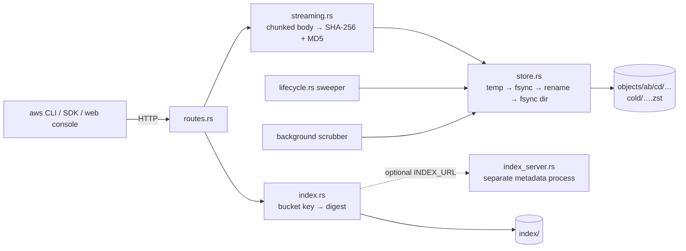

<div align="center">


# 🗄️ S3-Compatible Object Store

*The filesystem is the database: content-addressed blobs, streaming bodies, crash-safe commits, and S3's cursed ETag — built from scratch in Rust.*


</div>

"Store a blob, hand it back by name" sounds like `write(file)` / `read(file)` with an HTTP coat of paint — and for a 10 KB file on a laptop, it is. I built this project (number 06 in my [backend-gauntlet](../../README.md)) because every word in *S3-compatible object store* is a trap that only springs at scale. Objects are 5 GB, so the moment you write `let body = req.bytes()` one upload OOM-kills the box. The same bytes get uploaded a thousand times, so naming a blob by *where the user put it* stores it a thousand times. A crash mid-write must never leave a truncated file that looks complete. And to earn "S3-compatible" — so the real `aws` CLI talks to you — the ETag has to follow S3's exact, deliberately weird formula.

There's no Postgres, no Redis, no MinIO behind this. The parts you'd normally `cargo add` or point a container at — content addressing, the atomic durable commit, multipart assembly, prefix/delimiter listing, garbage collection — are exactly the parts I wrote by hand on top of a plain directory. That's the point of this repo: an object store is a layout discipline over a filesystem, not a service you call.

The one-sentence version of how it works: every request body streams chunk-by-chunk through two hashers at once into a temp file, commits via the temp → `fsync` → atomic `rename` → `fsync`-the-directory dance under a name that *is* the SHA-256 of its content, and only then does the key→blob index learn the pointer — so a crash at any instant leaves either a whole object or harmless garbage, never a lie.

---

## 🗺️ How it fits together



Two background loops run alongside the request path: a lifecycle sweeper that expires or zstd-tiers old objects, and a scrubber that re-hashes committed blobs so silent disk corruption gets quarantined instead of served. With `INDEX_URL` set, the index becomes a second process — the same blob-then-pointer contract, now with a network in the middle.

---

## ✅ What I built

The SPEC grades four verticals — the internals you'd normally never see. Three are done and proven; the fourth is one function away.

**V1 — the content-addressed blob store** ([`src/store/mod.rs`](src/store/mod.rs), [`src/durable.rs`](src/durable.rs)). A blob's filename is the SHA-256 of its bytes, sharded `objects/ab/cd/abcd…` so a flat directory never melts. Dedup falls out for free: two keys with identical content resolve to one file on disk. The real lesson was the commit sequence — you can't write straight to the final path, because a crash mid-write leaves a file with the right name and half the bytes, and every future reader trusts it. Write temp, `fsync` it, `rename` atomically, then `fsync` the *parent directory* so the rename itself survives power loss. Each fsync defends against a specific crash; I can now tell you which.

**V2 — streaming bodies end to end** ([`src/streaming.rs`](src/streaming.rs)). The whole vertical exists to prevent one bug: collecting a body into a `Vec<u8>`. Instead I pull one chunk at a time, enforce the size cap on the running count (never trusting `Content-Length` — chunked encoding and lying clients), write the chunk to the temp file, and feed it to *two* hashers in the same pass — SHA-256 for the content name, MD5 for the ETag. Backpressure costs nothing because I never ask for chunk N+1 until chunk N hit disk: a slow disk propagates back through TCP to slow the client, so memory can't balloon by construction. The unhappy paths were the actual work — a disconnect or a tripped cap must reclaim the temp file on every early exit. The tracker still holds this vertical open, honestly: the core streaming path works and is benched, but I folded checksum-validated uploads (`Content-MD5` / `x-amz-checksum-*`) into the same loop, and its final compare-against-client-digest is the one `todo!()` left in the crate.

**V3 — flat namespace, faked folders, GC** ([`src/index.rs`](src/index.rs)). S3 has no directories: `a/b/c.jpg` is one opaque key, and `ListObjectsV2` fakes the tree at query time by rolling keys that share the next `/`-segment into common prefixes, with sorted order, `max-keys`, and continuation tokens. The crash-consistency contract is one iron ordering — blob durable *first*, then the index pointer — so dying in between strands an unreferenced blob (garbage the GC sweeps) but never a key pointing at nothing. Delete drops only the pointer, because dedup means another key may share those bytes; a mark-and-sweep GC reclaims unreferenced blobs later, with a grace rule so it can't reap a blob whose PUT committed bytes but hasn't indexed yet.

**V4 — multipart upload and the cursed ETag** ([`src/multipart.rs`](src/multipart.rs)). A 5 GB upload over residential internet *will* die, so uploads become resumable sessions: initiate mints an `uploadId`, parts stream in any order (retries overwrite — that idempotency is what makes flaky networks survivable), and complete validates every part's ETag before concatenating in part-number order into a final blob committed through V1. The compatibility line is the ETag formula: a single PUT is `md5(bytes)`, but a multipart object is `md5(concat(part_md5s)) + "-N"` — *not* the MD5 of the assembled bytes. Computing it from the bytes looks more correct and breaks every S3 client. I got it bit-for-bit.

> [!NOTE]
> The verticals aren't the whole surface. The horizontal checklist — `Range` requests with `206`/`Content-Range`, conditional GETs (`If-None-Match` → `304`), real S3 XML for listings and multipart, path-traversal-proof key handling, Prometheus counters/gauges/histograms including dedup hits and in-flight uploads — is 13/14 done. The one open box is auth: right now an open `PUT` is an open disk, and gating writes behind an HMAC credential is queued work.

---

## 🔬 Beyond the SPEC

The SPEC carries an ungraded "From the field" backlog distilled from how S3, Azure, and Backblaze actually do this. Four items are formally adopted with proofs:

| Adopted | What it proves | Where |
|---|---|---|
| Property-based tests | Random inputs attack every vertical's invariant — naming safety, chunking-independent digests, listing/GC laws, the multipart ETag | [`tests/property.rs`](tests/property.rs) |
| Reference-model checking | The ShardStore method: one random op sequence drives the real store and a tiny in-memory model, and their observable state never diverges | [`tests/reference_model.rs`](tests/reference_model.rs) |
| Real-client interop | Arrow's Rust `object_store` crate does put/get/list/multipart against my endpoint, unpatched | [`tests/object_store_interop.rs`](tests/object_store_interop.rs) |
| Index-as-a-service | The key→blob index runs as a second process over HTTP; killing it mid-PUT fails metadata ops cleanly while blobs may already be durable — the distributed twin of blob-then-pointer | [`src/index_server.rs`](src/index_server.rs), [`docs/05`](docs/05-how-index-as-a-service-works.md) |

Several more have landed in code recently and are working through their sign-off (tests exist; I haven't flipped their backlog boxes yet): **object versioning** (GET/HEAD/DELETE by `versionId`, overwrite as an atomic pointer flip), **conditional writes** (`If-Match` compare-and-swap returning `412` on a stale ETag — the primitive that lets an object store double as a lock service), **lifecycle rules** with a transparent zstd **cold tier** (a GET of a tiered object still round-trips byte-exact — that's what the benchmark below measures), and **continuous scrubbing** (a background auditor re-hashes blobs and quarantines corruption before any reader sees it).

There's also a small **web console** ([`web/`](web/)) — React + TypeScript, talking only to the public S3 API — for poking at buckets, objects, and multipart sessions visually.

---

## 📊 Numbers

The graded Definition-of-done bench suite (sustained throughput, flat-RSS proof on an object bigger than RAM, the `kill -9` crash test) is still ahead of me. What I *have* measured is the cold-tier tradeoff, with an in-process harness ([`bench/hot_vs_cold/`](bench/hot_vs_cold/README.md)) that drives the real router and lifecycle sweeper over a temp data dir:

| payload | size | hot on disk | cold on disk | ratio | hot p50 | cold p50 |
|---|---|---:|---:|---:|---:|---:|
| compressible | 16 MiB | 16.00 MiB | 6.27 KiB | 2611× | 275.1 ms | 13.2 ms |
| compressible | 1 MiB | 1.00 MiB | 484 B | 2166× | 20.9 ms | 1.2 ms |
| incompressible | 16 MiB | 16.00 MiB | 16.00 MiB | 1.00× | 317.1 ms | 211.1 ms |

Run on my WSL2 box, release build, warm page cache. Two honest takeaways rather than a victory lap: the storage win on compressible data is enormous (repeating-text blobs shrink ~2000–2600×), but incompressible data doesn't shrink at all — zstd framing even adds bytes — so tiering blindly buys nothing and still forces a decode path. And the latency columns are *not* a cold-penalty story: with a warm cache, cold GETs read a tiny compressed file plus a cheap decode and come out faster; a disk-bound re-run with dropped caches is on my list before I quote GET cost anywhere serious. Every tiered sample round-tripped byte-exact. Full method and caveats in [`docs/06-benchmarks.md`](docs/06-benchmarks.md).

---

## 🚧 Where I am now

I'm closing out V2's last thread: the checksum-validated-upload compare (decode the client's base64 digest, match it against the already-computed SHA-256/MD5, reject with S3's `BadDigest` semantics — leaving nothing durable on mismatch). After that, the recently-landed versioning / conditional-write / tiering / scrubbing work gets its formal sign-off, and the two missing graded artifacts get written: the design doc (on-disk layout, why each fsync exists, the GC race resolution) and the full DoD benchmark run.

## 🔭 What's next

Auth is the one open graded box — a simplified access-key/HMAC scheme gating writes, with S3's session-scoped-token trick as the stretch goal so the hot path pays auth once per session instead of per request. Past that, the From-the-field items I most want are the **erasure-coding lab** (RS 4,2 over GF(2⁸), reconstructing a blob bit-exact after losing any two shards, then Local Reconstruction Codes on top), a **crash-injection harness** that kills the commit sequence at *every* step boundary instead of one hand-picked `kill -9`, putting the GC↔in-flight-PUT race under **Loom**, and a read-only **FUSE mountpoint** so `ls` and `pread` on a mounted bucket become list-with-delimiter and ranged GETs.

---

## 🚀 Run it

```bash
cd projects/06-object-store
make setup            # .env from .env.example — DATA_DIR is the whole "database"
make dev              # backend + web console together; console on :5173

# or just the store:
cargo run -p object-store          # S3 API on :9000

curl -X PUT localhost:9000/my-bucket
curl -X PUT localhost:9000/my-bucket/hello.txt --data-binary @hello.txt
curl        localhost:9000/my-bucket/hello.txt

# the gold standard — point the real AWS CLI at it:
aws --endpoint-url http://localhost:9000 s3 cp ./big.bin s3://my-bucket/big.bin
```

The three-container split (index service + S3 API + console) runs with `make stack` — ports are project-scoped: console `:5106`, API `:9006`, index `:9106`. `make verify` runs fmt-check, clippy, check, and the test suite; `make bench-tier` reproduces the numbers above.

---

## 📚 Deep dives

Everything I had to understand, I wrote down first-principles style:

- [`docs/00-how-s3-paths-work.md`](docs/00-how-s3-paths-work.md) — where I work out that S3 has no folders, and what `prefix`/`delimiter` actually compute.
- [`docs/01-how-multipart-uploads-work.md`](docs/01-how-multipart-uploads-work.md) — the resumable-session protocol, with the full worked derivation of the `-N` ETag.
- [`docs/02-how-etags-work.md`](docs/02-how-etags-work.md) — why one header does three unrelated jobs, and why an ETag is not a checksum.
- [`docs/03-how-fuse-mountpoint-works.md`](docs/03-how-fuse-mountpoint-works.md) — how a bucket can wear a filesystem as a disguise, Mountpoint-style.
- [`docs/04-how-continuous-scrubbing-works.md`](docs/04-how-continuous-scrubbing-works.md) — detect, quarantine, never serve: the at-rest auditor.
- [`docs/05-how-index-as-a-service-works.md`](docs/05-how-index-as-a-service-works.md) — splitting metadata from bytes, and what a process boundary does to crash semantics.
- [`docs/06-benchmarks.md`](docs/06-benchmarks.md) — the curated numbers and how they were measured.
- [`docs/07-durability-review.md`](docs/07-durability-review.md) — threat list + guardrails for blob publish, pointer flip, and cold-tier migration.
- [`docs/08-how-loom-and-shuttle-work.md`](docs/08-how-loom-and-shuttle-work.md) — concurrency model checkers (Loom exhaustive / Shuttle randomized) before the GC↔PUT race exercise.
- [`docs/09-how-session-scoped-auth-works.md`](docs/09-how-session-scoped-auth-works.md) — amortize expensive identity once; cheap integrity on every hot-path request (S3 Express–style sessions).
- [`docs/10-how-chunk-level-dedup-works.md`](docs/10-how-chunk-level-dedup-works.md) — content-defined chunking: near-duplicates share most on-disk bytes when whole-object dedup cannot.

The graded contract lives in [`SPEC.md`](SPEC.md); the concept map I test myself against is [`CONCEPTS.md`](CONCEPTS.md); the industry research it's all distilled from — how S3, ShardStore, Backblaze, and Haystack really work — is [`RESEARCH.md`](RESEARCH.md).
