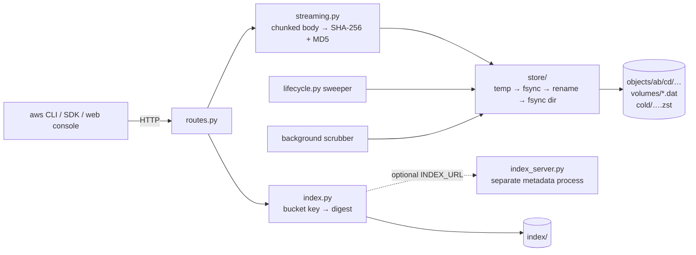

<div align="center">


# 🗄️ S3-Compatible Object Store

*The filesystem is the database: content-addressed blobs, streaming bodies, crash-safe commits, and S3's cursed ETag — built from scratch in Python.*


</div>

"Store a blob, hand it back by name" sounds like `write(file)` / `read(file)` with an HTTP coat of paint — and for a 10 KB file on a laptop, it is. I built this project (number 06 in my [backend-gauntlet](../../README.md)) because every word in *S3-compatible object store* is a trap that only springs at scale. Objects are 5 GB, so the moment you write `await request.body()` one upload OOM-kills the box. The same bytes get uploaded a thousand times, so naming a blob by *where the user put it* stores it a thousand times. A crash mid-write must never leave a truncated file that looks complete. And to earn "S3-compatible" — so the real `aws` CLI talks to you — the ETag has to follow S3's exact, deliberately weird formula.

There's no Postgres, no Redis, no MinIO behind this. The parts you'd normally `uv add` or point a container at — content addressing, the atomic durable commit, multipart assembly, prefix/delimiter listing, garbage collection — are exactly the parts I wrote by hand on top of a plain directory. That's the point of this repo: an object store is a layout discipline over a filesystem, not a service you call.

The one-sentence version of how it works: every request body streams chunk-by-chunk through two hashers at once into a temp file, commits via the temp → `fsync` → atomic `rename` → `fsync`-the-directory dance under a name that *is* the SHA-256 of its content, and only then does the key→blob index learn the pointer — so a crash at any instant leaves either a whole object or harmless garbage, never a lie.

---

## 🗺️ How it fits together


```mermaid
flowchart LR
    client[aws CLI / SDK / web console] -->|HTTP| routes[routes.py]
    routes --> streaming[streaming.py<br/>chunked body → SHA-256 + MD5]
    streaming --> store[store/<br/>temp → fsync → rename → fsync dir]
    store --> blobs[(objects/ab/cd/…<br/>volumes/*.dat<br/>cold/….zst)]
    routes --> index[index.py<br/>bucket key → digest]
    index -.optional INDEX_URL.-> indexsvc[index_server.py<br/>separate metadata process]
    index --> meta[(index/)]
    sweeper[lifecycle.py sweeper] --> store
    scrubber[background scrubber] --> store
```

Two background loops run alongside the request path: a lifecycle sweeper that expires or zstd-tiers old objects, and a scrubber that re-hashes committed blobs so silent disk corruption gets quarantined instead of served. With `INDEX_URL` set, the index becomes a second process — the same blob-then-pointer contract, now with a network in the middle.

---

## ✅ What I built

The SPEC grades four verticals — the internals you'd normally never see. All four are done and proven.

**V1 — the content-addressed blob store** ([`store/`](src/object_store/store/__init__.py), [`durable.py`](src/object_store/durable.py)). A blob's filename is the SHA-256 of its bytes, sharded `objects/ab/cd/abcd…` so a flat directory never melts. Dedup falls out for free: two keys with identical content resolve to one file on disk. The real lesson was the commit sequence — you can't write straight to the final path, because a crash mid-write leaves a file with the right name and half the bytes, and every future reader trusts it. Write temp, `fsync` it, `rename` atomically, then `fsync` the *parent directory* so the rename itself survives power loss. Each fsync defends against a specific crash; I can now tell you which. Python made one thing louder than Rust did: `fsync` has no asynchronous form on Linux, so every "async file I/O" runtime is a thread pool wearing a nicer face. Here the `asyncio.to_thread` is written out at the call site, which is the honest version.

**V2 — streaming bodies end to end** ([`streaming.py`](src/object_store/streaming.py)). The whole vertical exists to prevent one bug: `await request.body()`. Instead I pull one chunk at a time, enforce the size cap on the running count (never trusting `Content-Length` — chunked encoding and lying clients), write the chunk to the temp file, and feed it to *two* hashers in the same pass — SHA-256 for the content name, MD5 for the ETag. Backpressure costs nothing because I never ask for chunk N+1 until chunk N hit disk: a slow disk propagates back through TCP to slow the client, so memory can't balloon by construction. The unhappy paths were the actual work — a disconnect or a tripped cap must reclaim the temp file on every early exit, which is what the `TempEntry` guard is for. Checksum-validated uploads (`Content-MD5` / `x-amz-checksum-*`) fold into the same loop for free: whichever algorithm the client names, its digest is already one of the two, so verifying costs a base64 decode and a compare — and it happens *before* the commit, so a mismatch leaves nothing durable.

**V3 — flat namespace, faked folders, GC** ([`index.py`](src/object_store/index.py)). S3 has no directories: `a/b/c.jpg` is one opaque key, and `ListObjectsV2` fakes the tree at query time by rolling keys that share the next `/`-segment into common prefixes, with sorted order, `max-keys`, and continuation tokens. The crash-consistency contract is one iron ordering — blob durable *first*, then the index pointer — so dying in between strands an unreferenced blob (garbage the GC sweeps) but never a key pointing at nothing. Delete drops only the pointer, because dedup means another key may share those bytes; a mark-and-sweep GC reclaims unreferenced blobs later, with a grace rule so it can't reap a blob whose PUT committed bytes but hasn't indexed yet.

**V4 — multipart upload and the cursed ETag** ([`multipart.py`](src/object_store/multipart.py)). A 5 GB upload over residential internet *will* die, so uploads become resumable sessions: initiate mints an `uploadId`, parts stream in any order (retries overwrite — that idempotency is what makes flaky networks survivable), and complete validates every part's ETag before concatenating in part-number order into a final blob committed through V1. The compatibility line is the ETag formula: a single PUT is `md5(bytes)`, but a multipart object is `md5(concat(part_md5s)) + "-N"` — *not* the MD5 of the assembled bytes. Computing it from the bytes looks more correct and breaks every S3 client. I got it bit-for-bit — and the outer hash is over the *raw* 16-byte digests, not their hex, which is the way to get a plausible, entirely wrong answer.

> [!NOTE]
> The verticals aren't the whole surface. The horizontal checklist — `Range` requests with `206`/`Content-Range`, conditional GETs (`If-None-Match` → `304`), real S3 XML for listings and multipart, path-traversal-proof key handling, Prometheus counters/gauges/histograms including dedup hits and in-flight uploads — is done. Auth is written and tested (presigned URLs *or* bearer credentials, gating object routes when `SECRET_ACCESS_KEY` is set), and I've left its graded box unticked until I've decided whether a simplified HMAC scheme is the bar I meant, or whether it has to be real SigV4.

---

## 🔬 Beyond the SPEC

The SPEC carries an ungraded "From the field" backlog distilled from how S3, Azure, and Backblaze actually do this. Four items are formally adopted with proofs:

| Adopted | What it proves | Where |
|---|---|---|
| Property-based tests | Hypothesis attacks every vertical's invariant with generated inputs — naming safety, framing-independent digests, listing and GC laws, the multipart ETag | [`tests/test_property.py`](tests/test_property.py) |
| Erasure-coding lab | RS(4,2) over GF(2⁸) reconstructs bit-exact after *any* two of six shards are lost, LRC repairs one shard from 2 reads instead of 4, and the nines calculator lands where Backblaze's published numbers do | [`erasure/`](src/object_store/erasure/__init__.py), [`docs/12`](docs/12-how-erasure-coding-works.md) |
| Chunk-level dedup | Content-defined chunking with a Gear hash: two 200 KB objects differing by one inserted byte share >80% of their on-disk chunks, which whole-object dedup can never do | [`cdc.py`](src/object_store/cdc.py), [`manifest.py`](src/object_store/manifest.py) |
| Haystack packing | Thousands of tiny objects land in one append-only volume instead of one inode each, located by an in-memory needle map, with a WAL for the index and compaction for the tombstones | [`store/haystack.py`](src/object_store/store/haystack.py), [`docs/11`](docs/11-how-haystack-packing-works.md) |
| Index-as-a-service | The key→blob index runs as a second process over HTTP; killing it mid-PUT fails metadata ops cleanly while blobs may already be durable — the distributed twin of blob-then-pointer | [`index_server.py`](src/object_store/index_server.py), [`docs/05`](docs/05-how-index-as-a-service-works.md) |

Also landed and tested: **object versioning** (GET/HEAD/DELETE by `versionId`, overwrite as an atomic pointer flip, and version ids that are never reused even when you delete the newest), **conditional writes** (`If-Match` compare-and-swap returning `412` on a stale ETag — the primitive that lets an object store double as a lock service), **lifecycle rules** with a transparent compressed **cold tier**, and **continuous scrubbing** (a background auditor re-hashes blobs and quarantines corruption before any reader sees it).

The one item still genuinely open is third-party interop. The XML shape is asserted against this project's own parser, which is strictly weaker than it sounds — a schema can be self-consistently wrong. Closing it needs a client nobody here wrote.

There's also a small **web console** ([`web/`](web/)) — React + TypeScript, talking only to the public S3 API — for poking at buckets, objects, and multipart sessions visually.

---

## 📊 Numbers

The graded Definition-of-done harness ([`bench/harness/`](bench/harness/README.md)) proves the two payoffs that matter, driving the real ASGI app over a temp data dir:

| measurement | result |
|---|---:|
| upload / download throughput | 58 / 321 MiB/s |
| **RSS growth over a 256 MiB object** | **0.8 MiB — 0.29%** |
| dedup: 8 identical PUTs | 1 blob, 87.5% saved |
| multipart ETag vs S3's `-N` formula | exact match |

The flat-RSS line is V2's whole point, and it cost an hour to measure honestly: my first run reported 261 MiB of growth and I nearly went hunting for a buffer in the stream loop. The buffer was in the *test* — httpx's `ASGITransport` accumulates the entire response body before returning it, so I was measuring the client. Driving the ASGI app directly with a `send` that counts and drops gives the real number.

What I've also measured is the cold-tier tradeoff, with an in-process harness ([`bench/hot_vs_cold/`](bench/hot_vs_cold/README.md)) that drives the lifecycle sweeper with an injected clock:

| payload | size | hot on disk | cold on disk | ratio | hot p50 | cold p50 |
|---|---|---:|---:|---:|---:|---:|
| compressible | 16 MiB | 16.00 MiB | 6.27 KiB | 2611× | 275.1 ms | 13.2 ms |
| compressible | 1 MiB | 1.00 MiB | 484 B | 2166× | 20.9 ms | 1.2 ms |
| incompressible | 16 MiB | 16.00 MiB | 16.00 MiB | 1.00× | 317.1 ms | 211.1 ms |

Run with a warm page cache. Two honest takeaways rather than a victory lap: the storage win on compressible data is enormous (repeating-text blobs shrink ~2000–2600×), but incompressible data doesn't shrink at all — zstd framing even adds bytes — so tiering blindly buys nothing and still forces a decode path. And the latency columns are *not* a cold-penalty story: with a warm cache, cold GETs read a tiny compressed file plus a cheap decode and come out faster; a disk-bound re-run with dropped caches is on my list before I quote GET cost anywhere serious. Every tiered sample round-tripped byte-exact. Full method and caveats in [`docs/06-benchmarks.md`](docs/06-benchmarks.md).

---

## 🚧 Where I am now

Two graded artifacts left. The design doc (`docs/06-design.md`) — on-disk layout and fan-out, why each fsync is where it is, the index format and the blob-then-pointer invariant, the prefix/delimiter algorithm, the two ETag formulas, and the GC↔in-flight-PUT race resolution. And the profile: throughput numbers alone don't close the Definition of done, because the interesting question is *why* they are what they are. Both hashers run over every uploaded byte and `hashlib` releases the GIL on large buffers, so hashing genuinely parallelises across threads while per-chunk interpreter overhead does not — which of the two sets the ceiling depends on the chunk size, and `make profile` is what answers it rather than my intuition.

## 🔭 What's next

The From-the-field items I most want next are a **crash-injection harness** that kills the commit sequence at *every* step boundary rather than one hand-picked moment (`bench/harness/crash.py` does the single-point version today), **third-party interop** against a client nobody here wrote, S3's **session-scoped auth** trick so the hot path pays identity once per session instead of per request, and a read-only **FUSE mountpoint** so `ls` and `pread` on a mounted bucket become list-with-delimiter and ranged GETs.

---

## 🚀 Run it

```bash
cd projects/06-object-store
make setup && make sync   # .env from .env.example, then resolve the workspace
make dev                  # backend + web console together; console on :5173

# or just the store:
make run                  # S3 API on :9000

curl -X PUT localhost:9000/my-bucket
curl -X PUT localhost:9000/my-bucket/hello.txt --data-binary @hello.txt
curl        localhost:9000/my-bucket/hello.txt

# the gold standard — point the real AWS CLI at it:
aws --endpoint-url http://localhost:9000 s3 cp ./big.bin s3://my-bucket/big.bin
```

The three-container split (index service + S3 API + console) runs with `make stack` — ports are project-scoped: console `:5106`, API `:9006`, index `:9106`. `make verify` runs the CI gate (ruff format, ruff, pyright strict, pytest); `make bench` and `make bench-tier` reproduce the numbers above. Two probes are worth knowing: `make layout` shows what actually landed on disk under `DATA_DIR` — FileCas blobs vs Haystack needles vs cold-tier files vs quarantine — and `make dedup` prints logical bytes against physical bytes, which is the only honest way to show V1's payoff.

---

## 📚 Deep dives

Everything I had to understand, I wrote down first-principles style:

- [`docs/00-how-s3-paths-work.md`](docs/00-how-s3-paths-work.md) — where I work out that S3 has no folders, and what `prefix`/`delimiter` actually compute.
- [`docs/01-how-multipart-uploads-work.md`](docs/01-how-multipart-uploads-work.md) — the resumable-session protocol, with the full worked derivation of the `-N` ETag.
- [`docs/02-how-etags-work.md`](docs/02-how-etags-work.md) — why one header does three unrelated jobs, and why an ETag is not a checksum.
- [`docs/03-how-fuse-mountpoint-works.md`](docs/03-how-fuse-mountpoint-works.md) — how a bucket can wear a filesystem as a disguise, Mountpoint-style.
- [`docs/04-how-continuous-scrubbing-works.md`](docs/04-how-continuous-scrubbing-works.md) — detect, quarantine, never serve: the at-rest auditor.
- [`docs/05-how-index-as-a-service-works.md`](docs/05-how-index-as-a-service-works.md) — splitting metadata from bytes, and what a process boundary does to crash semantics.
- [`docs/06-benchmarks.md`](docs/06-benchmarks.md) — the curated numbers and how they were measured, including the one that lied.
- [`docs/06-design.md`](docs/06-design.md) — the graded design doc: on-disk layout and fan-out, why each fsync is where it is, the blob-then-pointer invariant, the listing algorithm, the two ETag formulas, the GC race, and which operations sit on the event loop versus in the thread pool.
- [`docs/07-durability-review.md`](docs/07-durability-review.md) — threat list + guardrails for blob publish, pointer flip, and cold-tier migration.
- [`docs/08-how-loom-and-shuttle-work.md`](docs/08-how-loom-and-shuttle-work.md) — concurrency model checkers before the GC↔PUT race exercise. Written against Rust's Loom and Shuttle; the *method* transfers, the tools don't, and finding the Python equivalent is part of the exercise.
- [`docs/09-how-session-scoped-auth-works.md`](docs/09-how-session-scoped-auth-works.md) — amortize expensive identity once; cheap integrity on every hot-path request (S3 Express–style sessions).
- [`docs/10-how-chunk-level-dedup-works.md`](docs/10-how-chunk-level-dedup-works.md) — content-defined chunking: near-duplicates share most on-disk bytes when whole-object dedup cannot.
- [`docs/11-how-haystack-packing-works.md`](docs/11-how-haystack-packing-works.md) — small-object packing: thousands of tiny blobs in a few append-only volume files, located by an in-memory map instead of one inode each.
- [`docs/12-how-erasure-coding-works.md`](docs/12-how-erasure-coding-works.md) — surviving lost disks for a fraction of replication's cost: Reed–Solomon RS(4,2) → Local Reconstruction Codes → the durability ("nines") calculator, from XOR up.

The graded contract lives in [`SPEC.md`](SPEC.md); the concept map I test myself against is [`CONCEPTS.md`](CONCEPTS.md); the industry research it's all distilled from — how S3, ShardStore, Backblaze, and Haystack really work — is [`RESEARCH.md`](RESEARCH.md).
