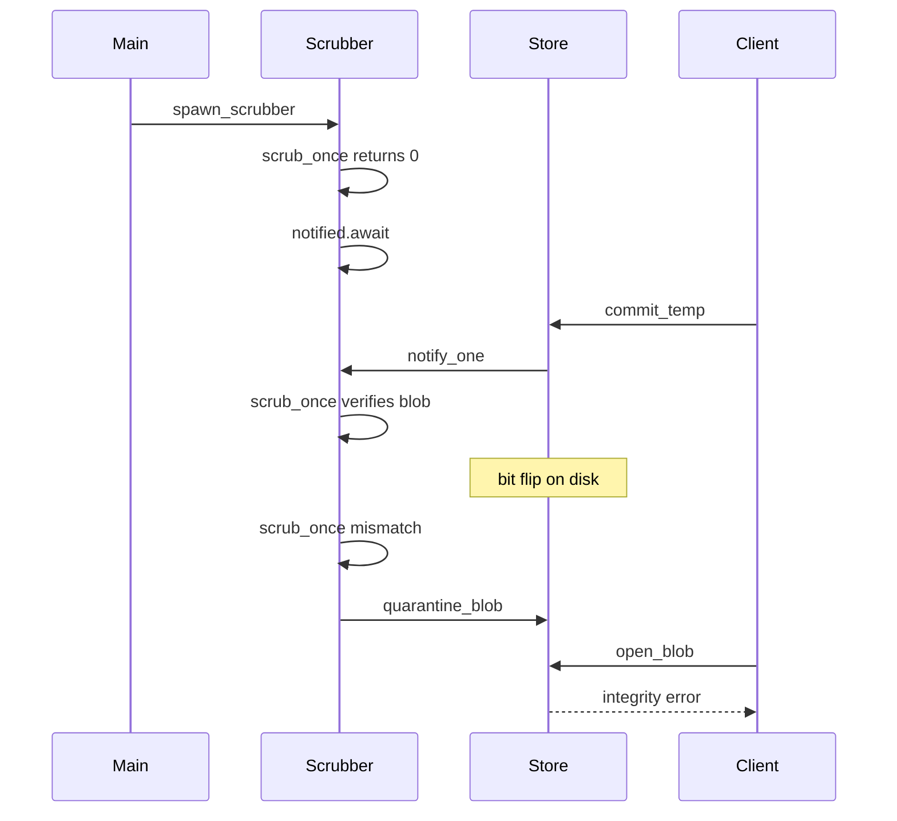

# How Continuous Scrubbing Works — From First Principles

> A beginner-friendly, ground-up guide to **continuous scrubbing**: the background
> auditor that re-hashes committed blobs so silent disk corruption cannot be
> served to readers. No prior knowledge of ZFS, erasure coding, or S3 durability
> math assumed — but it helps if you already know V1's content-addressed store
> (hash = name).
>
> This teaches the **concept** and how *this project's* scrubber is wired. It is
> not a repair plane (no replicas / erasure coding here): detect, quarantine,
> metric, refuse GET. Anchored to real code:
> [`src/store.rs`](../src/store.rs) (the scrubber),
> [`src/metrics.rs`](../src/metrics.rs) (the counters),
> [`src/main.rs`](../src/main.rs) (spawn),
> [`SPEC.md`](../SPEC.md) (From the field),
> [`RESEARCH.md`](../RESEARCH.md) §Part 4.

---

## 0. The one sentence to hold onto

**In a content-addressed store the blob's name *is* its hash — so detecting a
flipped disk byte is just "re-hash the file and ask: does it still match its own
name?" Continuous scrubbing is that check, run forever in the background, before
any reader is handed corrupt bytes.**

Write-path hashing (V2 streaming PUT) catches *ingress* bugs. Scrubbing catches
*at-rest* bugs that appear months later. Same invariant: `hash(bytes) == name`.

---

## 1. The problem: disks lie quietly

Imagine day zero: a client PUTs a photo. Your store hashes the body to
`3a7f…c9`, writes temp → fsync → rename → fsync-dir, and the blob lives at
`objects/3a/7f/3a7f…c9`. Every GET trusts that path and streams the file out.

Months later nothing looks broken. SMART looks fine. No process crashed. But one
bit on the platter flipped — **silent data corruption**, also called **bit rot**.
Hard drives do this at tiny rates (on the order of one undetected error per
~10¹⁴–10¹⁵ bits read). At petabyte scale that is not theoretical; it is expected.

The filesystem still returns the file. Your API still returns 200. The client gets
a JPEG with one pixel wrong — or a parquet footer that fails mid-query, or a
Docker layer that fails to extract after a "successful" pull.

**Replication alone does not save you if you never look.** Three copies of a
silently corrupted shard can sit there looking healthy until the day you need
them. Erasure coding's math assumes you *notice* when a shard is wrong so you can
reconstruct from the others. Without a detective walking the data, durability
numbers on a slide are optimism.

The world before scrubbing is: "we wrote it correctly once, and we hope the disk
never lies."

---

## 2. Why CAS makes the check free

A **content-addressed store (CAS)** names every blob by a cryptographic hash of
its bytes — here, SHA-256 hex. V1 in [`src/store.rs`](../src/store.rs) does
exactly this: the on-disk path *is* the digest, sharded as
`objects/<ab>/<cd>/<64-hex>`.

That buys two properties you already use:

| Property | Consequence |
| --- | --- |
| Identical bytes → same path | Dedup for free |
| Path encodes expected hash | Integrity check needs no side table |

In a traditional file store (`photos/cat.jpg`) you would need a separate catalog
of expected checksums, keep it consistent across renames, and trust that catalog.
In a CAS, the filesystem layout *is* the checksum database.

Verification collapses to:

```
for each committed blob path P under objects/:
    expected = digest_from_path(P)   // inverse of blob_path
    if sha256(read(P)) != expected:
        CORRUPT → quarantine / metric / refuse open
```

`digest_from_path` is the inverse of `blob_path`: it only accepts the sharded
layout (`ab/cd/<64-hex>`). Junk files under `objects/` (e.g. `not-a-digest.bin`)
are skipped — they are not content addresses.

---

## 3. Store vs index: scrubbing does not live on the namespace

Your project splits two jobs:

| Layer | Module | Owns | Question |
| --- | --- | --- | --- |
| CAS / Store | V1 `store.rs` | `objects/<hash>` bytes | Are these *bytes* intact? |
| Index | V3 `index.rs` | `(bucket, key) → digest` | What is this *named*? |

Scrubbing answers only the first question. It walks committed blobs, not keys.
The index can still point at a digest after quarantine; that pointer remains
true ("this key's content address is D"). What changes is the Store's answer to
`open_blob(D)`: refuse.

You do **not** need a Store → Index callback. The GET path already couples them:

```
index.resolve(bucket, key)  →  digest + meta
store.open_blob(digest)     →  bytes   ← quarantine gate lives here
```

Why not push quarantine into the index?

1. **Wrong question.** Index owns names → pointers. Integrity is a Store fact.
2. **Dedup.** One bad digest can back many keys. Quarantine once in Store; every
   GET that lands on that digest fails. Updating the index would mean finding
   every key that references D — the inverse of GC — for no gain.
3. **The error already bubbles.** Handlers already `?` on `open_blob`. A
   quarantined digest becomes an internal error (HTTP 500 / `InternalError`)
   rather than a silent 200 with wrong bytes.

GC and scrubbing are sibling background jobs, not the same job:

- **GC** asks: is anything still pointing at this digest?
- **Scrubbing** asks: do these bytes still match their name?

---

## 4. The durability pipeline: detect → quarantine → observe

A useful scrubber is not just a hasher. It is a small pipeline:

```
  [walk objects / re-hash]
           |
     +-----+-----+
     |           |
   match      mismatch
     |           |
     v           v
  [mark OK]  [quarantine] --> [metric + alert]
                |
                v
         open_blob refuses
```

In this learning store there is **no repair plane** (no second replica, no
erasure shards to rebuild from). Production systems (S3, Ceph, Azure) glue
detection to reconstruction. Your SPEC's observable bar still holds:

> a deliberately flipped byte on disk is detected, quarantined, and surfaced as
> a metric before any reader is served the corrupt bytes

| Step | What this repo does |
| --- | --- |
| Detect | Recompute SHA-256; compare to `digest_from_path` |
| Quarantine | Mark digest in an in-memory set; `rename` file to `quarantine/<digest>` |
| Observe | Increment `object_store_scrub_corruptions_total` (and friends) |
| Serve | `open_blob` / `open_blob_range` error if quarantined |

Quarantine-without-repair is a **latent outage**: you stopped serving poison, but
the object is unavailable until restored from backup. That is the honest tradeoff
for a single-node CAS.

---

## 5. How this implementation runs

### 5.1 Pieces

All of this lives on `Store` in [`src/store.rs`](../src/store.rs):

| Piece | Role |
| --- | --- |
| `Scrubber` | Holds `Notify`, quarantined `HashSet`, `quarantine/` path |
| `scrub_once` | One full walk of `objects/`; returns blobs examined |
| `run_scrubber` | Forever loop: scrub → idle wait or rescan timer |
| `spawn_scrubber` | `tokio::spawn` the loop (same pattern as lifecycle) |
| `commit_temp` | After a real publish, `notify_one()` to wake an idle scrubber |
| `open_blob` | Refuse if `is_quarantined(digest)` |

`main` starts it like the lifecycle sweeper
([`src/main.rs`](../src/main.rs)):

```rust
let _scrubber = state.store.clone().spawn_scrubber(scrub_rescan_interval);
// SCRUB_RESCAN_INTERVAL_SECS, default 300
```

### 5.2 The idle / Notify contract

Empty `objects/` must not busy-loop. The loop is:

1. Run `scrub_once`.
2. If it examined **0** blobs → increment `scrub_idle_waits_total`, then
   `notified().await` (park until a commit).
3. If it examined **N > 0** → `select` between `notified()` and
   `sleep(rescan_interval)` so bit-rot is rechecked on a timer, but a new commit
   can wake early.
4. On I/O error → log, sleep 1s, retry.

`commit_temp` only notifies after a *new* durable publish (not on a dedup hit —
the blob was already on disk). Tokio's `Notify` stores a permit if `notify_one`
happens before a waiter arrives, so the classic "commit between scrub finishing
and waiting" race still wakes the next `notified().await`.

### 5.3 One scrub pass

`scrub_once` DFS-walks `objects/`, skips non-files and paths that fail
`digest_from_path`, skips already-quarantined digests, streams each file through
SHA-256 with a reused 1 MiB buffer, then either counts a verification or calls
`quarantine_blob`.

### 5.4 Lifecycle of a corrupt blob



---

## 6. A worked example

You store one blob:

```
objects/3a/7f/3a7f…c9
```

the 64 hex chars are `SHA-256(photo_bytes)`.

**Day 0 — PUT succeeds.** Streaming writer hashed the body, committed via
temp→fsync→rename. Dedup: a second key with the same photo points at the same
file. `commit_temp` notifies the scrubber; a pass verifies the blob.

**Day 200 — bit flip.** Sector-level corruption flips one bit. The path is
unchanged. `ls` looks fine.

**Day 201 — scrubber wakes** (rescan timer or a later commit's notify):

1. Open the file, stream through SHA-256.
2. Computed digest ≠ name on the path.
3. Mark quarantined; move file to `quarantine/3a7f…c9`.
4. Emit `object_store_scrub_corruptions_total`.
5. Concurrent GET for any key mapping to that digest hits `open_blob` → error.
   Never streams the flipped bytes.

| Moment | Without scrubbing | With scrubbing |
| --- | --- | --- |
| After bit flip, before any GET | Corrupt bytes sit silently | Eventually detected on scan |
| First GET after flip | 200 + wrong body | Blocked (integrity error) |
| Operator visibility | Client complaint | Metric + file in `quarantine/` |

The unit tests in `store.rs` encode this: flip a byte, `scrub_once`, assert
quarantine + `open_blob` / `open_blob_range` refuse, assert the file left
`objects/`.

---

## 7. Numbers and tradeoffs worth knowing

| Quantity | Ballpark | Why it matters |
| --- | --- | --- |
| Silent disk bit error rate | ~1 per 10¹⁴–10¹⁵ bits read | At EB·years of storage, corruption is expected |
| S3 durability target | 11 nines | Credible only with EC/replication *plus* detection/repair |
| SHA-256 throughput | ~0.5–2 GB/s/core | Scrub CPU rarely beats disk bandwidth as the bottleneck |
| Default rescan interval here | 300s (`SCRUB_RESCAN_INTERVAL_SECS`) | How long intact data waits between full re-checks when the store is non-empty |
| HDD random IOPS | ~100–200 | Aggressive scrubbing competes with serving traffic — throttle in real systems |

**GET-path verify vs background scrub.** Hashing on every GET gives the strongest
"never serve corrupt" guarantee but taxes every read. Background scrub amortizes
cost and catches *cold* data that is never read. Many production systems do both:
a cheap CRC on read, full cryptographic re-hash on a slow scrub schedule. This
project does the background half (plus the write-path hash at PUT time).

**I/O tax.** Naively hashing every byte as fast as the disk allows starves client
GETs. Real scrubbers budget bytes/sec and sit below serving priority. Your loop
is intentionally simple: full pass, then sleep or notify — good enough to learn
the invariant; not a heat-managed fleet scrubber.

---

## 8. The tricky parts

- **Hash mismatch ≠ "disk is dying."** It can also be a writer bug, a hand-edited
  data dir, or a partial rename you thought was impossible. Scrubbing finds
  *divergence from the content address*; root cause is a separate step.
- **Quarantine without repair is a latent outage.** You traded a silent integrity
  lie for an availability failure. Production glues scrubbing to repair.
- **Dedup amplifies blast radius.** One corrupted CAS blob poisons every logical
  key that pointed at that digest. Quarantine + repair of that single path fixes
  all of them at once — another reason CAS and scrubbing are a natural pair.
- **Don't scrub `tmp/`.** Incomplete writes are not content addresses yet. Only
  finalized paths under `objects/` are in the auditor's contract.
- **Junk under `objects/`.** Files that fail `digest_from_path` are ignored. Do
  not parse filenames with a blind `unwrap`.
- **Notify vs timer.** An empty store parks forever until `commit_temp`. A
  non-empty store needs the rescan interval (or another notify) to catch bit rot
  on data that is not being rewritten.
- **In-memory quarantine set.** The set is process-local. After a restart, a
  blob still sitting in `quarantine/` is no longer under `objects/`, so
  `open_blob` naturally 404s via missing file — but a blob that was marked bad
  *without* a successful rename would need the next scrub pass (or a restart
  scan of `quarantine/`) to re-arm the set. Know what your failure modes are.
- **Thundering repair.** At hyperscale, finding a whole disk's worth of
  corruption at once can melt the network with reconstruction traffic. Rate-limit
  repair the same way you rate-limit scrub.

---

## 9. Metrics

Defined in [`src/metrics.rs`](../src/metrics.rs); scraped via `GET /metrics`
after `metrics::install()` in `main`.

| Metric | Meaning |
| --- | --- |
| `object_store_scrub_passes_total` | Completed full walks of `objects/` |
| `object_store_scrub_blobs_verified_total` | Blobs whose bytes still matched their name |
| `object_store_scrub_corruptions_total` | Blobs quarantined after mismatch |
| `object_store_scrub_bytes_scanned_total` | Bytes read while re-hashing |
| `object_store_scrub_idle_waits_total` | Times the scrubber parked on Notify because the tree was empty |
| `object_store_scrub_pass_duration_seconds` | Wall time of one full pass |

Unit tests do not assert these counters (the metrics facade is a no-op until
`install`); they assert quarantine and open behavior instead. The SPEC's "surfaced
as a metric" bar is what you watch in a running process.

---

## 10. How this connects to the rest of the project

- **V1 atomic commit** (temp→fsync→rename→fsync-dir) establishes that a path once
  meant "complete correct bytes." Scrubbing re-validates that meaning over time.
- **V2 streaming hash** protects the wire and the write path; scrubbing protects
  data at rest.
- **V3 index / GC** manage the namespace and unreferenced blobs; scrubbing does
  not replace them and does not update index rows.
- **Lifecycle sweeper** is another background loop with the same spawn pattern;
  scrubbing is the integrity cousin of expire/tier.
- **RESEARCH.md §Part 4** — durability as a process: end-to-end checksums,
  continuous auditors, durability reviews. AWS's framing: microservices that
  "continuously inspect every single byte across the entire fleet."
- **SPEC From the field** — the `[~]` continuous scrubbing item is the checklist
  this implementation and its tests aim at.

---

## 11. Go deeper

- ZFS / Btrfs **data scrubbing** — filesystem-level ancestor: checksum trees +
  scheduled scrub of every block.
- Ceph **deep scrub** of placement groups — compare replicas / EC shards, not
  just "does the object exist."
- Backblaze durability posts and calculator — how "11 nines" is computed from
  failure rate × repair window (detection latency is part of that window).
- AWS / Andy Warfield talks on S3 durability — continuous auditors + durability
  reviews as threat modeling for storage.
- This project's [`RESEARCH.md`](../RESEARCH.md) §Part 4 and the scrubber unit
  tests in [`src/store.rs`](../src/store.rs) (`scrub_*`,
  `commit_wakes_idle_scrubber_*`).

---

## Sticky note

> Scrubbing is continuous distrust of the disk: if the name is the hash,
> re-hashing is the audit — and you do it *before* a client pays the price.
