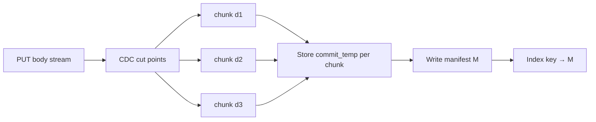

# How Chunk-Level Dedup Works — From First Principles

> A beginner-friendly, ground-up guide to **chunk-level deduplication** via
> **content-defined chunking (CDC)**: the idea that two large objects differing
> by a small edit can share most of their on-disk bytes. No prior knowledge of
> Rabin fingerprints, backup systems, or block-level CAS assumed — but it helps
> if you already know V1's content-addressed store (hash = name).
>
> **Naming first:** **CDC** here means **content-defined chunking**. It is
> **not** Change Data Capture (tailing a database WAL). Same acronym, unrelated
> idea. In this project the From-the-field line means the chunking kind.
>
> This teaches the **concept**. It does **not** implement the From-the-field
> backlog item — that stays yours if you adopt it. No new module, no manifest
> format shipped here.
>
> Anchored to: [`SPEC.md`](../SPEC.md) (From the field → Chunk-level dedup),
> [`src/store.rs`](../src/store.rs) (whole-object CAS today),
> [`src/lifecycle.rs`](../src/lifecycle.rs) (hash-then-compress — the unblocker),
> [`docs/07-durability-review.md`](07-durability-review.md) Path C,
> industry notes in [`RESEARCH.md`](../RESEARCH.md) §Part 6.

---

## 0. The one sentence to hold onto

**Whole-object dedup collapses *copies*; chunk-level CDC collapses *similarity*
— because cut points come from the bytes themselves, not from fixed offsets.**

Once that clicks: an insert in the middle of a file only dirties a few chunks;
everything before and after can still share storage with the previous version.
Fixed-size slicing cannot say that.

---

## 1. Clarify the name: CDC ≠ Change Data Capture

| People say… | They mean… |
| --- | --- |
| **CDC** (this doc / SPEC) | **Content-defined chunking** — pick chunk boundaries from a rolling hash over the bytes. |
| **CDC** (databases / outbox) | **Change Data Capture** — tail the WAL/binlog and emit row-change events. Unrelated. |
| **Dedup** (V1 today) | Two identical objects → one blob. Whole-file grain. |
| **Dedup** (this lab) | Two *similar* objects → many shared chunks + a few unique ones. Finer grain. |

Your SPEC names it directly:

> Chunk-level dedup (content-defined chunking): two large objects differing
> by a small edit share most of their on-disk bytes — whole-object dedup only
> ever shares identical files
> — [`SPEC.md`](../SPEC.md)

Read that against §0. The acceptance criterion is an *observable outcome*
(shared on-disk bytes for near-duplicates), not a prescribed rolling-hash
polynomial. CDC is the usual way to get that outcome without the boundary-shift
trap in §3.

---

## 2. The problem: whole-object dedup stops at "identical"

Imagine day zero. A client PUTs a 2 GB VM image:

```
PUT /bucket/vm-golden.img   →  SHA-256(bytes) = aaa…aaa
                               stored once at objects/aa/aa/aaa…aaa
```

Tomorrow they change one config file inside the image and upload again:

```
PUT /bucket/vm-patched.img  →  SHA-256(bytes) = bbb…bbb
                               stored once at objects/bb/bb/bbb…bbb
```

The two files share ~99.9% of their bytes. Your V1 CAS cannot see that. The
digest is of the *entire* blob; one flipped bit → a new name → a full second
copy on disk. Dedup only fires when two PUTs are **byte-identical**.

That is not a bug in content addressing. It is the grain size you chose:

| Grain | Wins when… | Loses when… |
| --- | --- | --- |
| Whole object (today) | Same Docker layer uploaded twice; same avatar; exact clones | Backups, patched images, near-duplicate videos, "save as" edits |
| Chunk (this lab) | Large files that mostly overlap | Tiny objects (metadata cost can exceed the win) |

The world before CDC is: "we store each unique file once" — which is already
great — and "similar files pay full price." Backup systems, container registries
with layer diffs, and some object stores push the grain down so *similarity*
pays too.

---

## 3. Fixed-size cuts look obvious — and fail

Naive approach: split every object into fixed 64 KiB slices, hash each slice,
store unique slices once.

```
file A:  [ 0 ][ 1 ][ 2 ][ 3 ][ 4 ][ 5 ]
file B:  insert one byte at the start
         [ 0'][ 1'][ 2'][ 3'][ 4'][ 5']   ← almost every slice shifts
```

That is the **boundary-shift problem**. An insert (or delete) at offset 0 moves
every subsequent cut. Cryptographic hashes of the shifted slices almost never
match the old ones, so you store nearly a full second copy — CDC's promised win
evaporates.

Fixed-size chunking *does* work for append-only workloads that never insert in
the middle (some log formats). Object stores see arbitrary edits. You need cut
points that **move with the content**.

---

## 4. Content-defined chunking — boundaries from the bytes

**Content-defined chunking** walks the byte stream with a **rolling hash** (a
fingerprint over a sliding window — Rabin-style fingerprints are the classic
teaching example; FastCDC and friends are modern variants). After each window
advance you ask: "does this fingerprint look like a boundary?"

A common rule:

```
if (rolling_hash & mask) == 0:
    cut here   // e.g. mask with ~16 low bits → ~64 KiB average chunk
```

Because the decision depends only on a window of *content*, the same byte
sequence produces the same cut — whether it sits at offset 0 or offset 1_000_000.
An insert in the middle typically:

1. dirties the chunk that contains the edit (and maybe one neighbor), and
2. leaves earlier and later chunks' boundaries — and therefore their digests —
   unchanged.

```
file A:  [ c1 ][ c2 ][ c3 ][ c4 ][ c5 ]
                    ↑ edit lands here
file B:  [ c1 ][ c2 ][ c3'][ c4 ][ c5 ]
                      ↑ only c3' is new on disk
```

You still clamp with **min / avg / max** chunk sizes so pathological inputs
cannot emit millions of tiny chunks or one giant blob:

| Knob | Why it exists |
| --- | --- |
| **Min size** | Avoid hashing/cutting every few bytes on adversarial or low-entropy input |
| **Target / avg** | Set by the mask; trades dedup ratio against metadata count |
| **Max size** | Force a cut so one unlucky region cannot become a multi-GB chunk |

The rolling hash is for **where to cut**. Each resulting chunk is then hashed
with your normal content digest (SHA-256 in this project) and stored under that
name — same CAS discipline as V1, finer unit.

---

## 5. How it maps onto *this* store

Today (whole-object CAS):

```
index:  (bucket, key) → digest D
store:  objects/<D>     = the full plaintext bytes
```

With chunk-level CDC, the CAS unit becomes the **chunk**, and an object becomes
a small **manifest** — an ordered list of chunk digests (and sizes):

```
index:  (bucket, key) → manifest digest M   (or inline manifest — design choice)
store:  objects/<M>     = [d1, d2, d3, …]   # the recipe
        objects/<d1>    = chunk bytes
        objects/<d2>    = chunk bytes
        …
```



**PUT path (conceptually):**

1. Stream the body (V2 already pulls one network chunk at a time — that framing
   is *not* CDC; see §8).
2. Feed bytes into the rolling-hash cutter; emit content-defined chunks.
3. For each chunk: stage → hash → `commit_temp` into the blob store (dedup if
   that digest already exists).
4. Build the manifest; commit the manifest as its own content-addressed blob.
5. Point the index at the manifest (blob-then-pointer still holds: all chunk
   bytes and the manifest durable **before** the key becomes visible).

**GET path:**

1. Resolve key → manifest digest → read the ordered chunk list.
2. Stream chunk files in order (or serve a `Range` by skipping/slicing chunks).
3. Client still sees one object; assembly is internal.

Dedup is still a *consequence* of content addressing — you just address smaller
pieces. Two manifests that share digest entries share those on-disk chunk files.
GC's mark phase must walk manifests and mark every referenced chunk (same
refcount idea as today, one level deeper).

You do **not** need a new hash algorithm for identity. SHA-256 of each chunk's
plaintext remains the name. CDC only chooses *where* the slices fall.

---

## 6. Why the cold tier unblocked this lab

Tiering already forced a design fork documented in
[`src/lifecycle.rs`](../src/lifecycle.rs):

> - *compress-then-hash*: cold file named by the compressed hash → breaks
>   dedup and orphans every index entry pointing at the old digest. **No.**
> - *hash-then-compress*: identity stays the **plaintext** digest; compression
>   is a *physical encoding of a blob*, not a new identity. **This is the one
>   we build.**

[`docs/07-durability-review.md`](07-durability-review.md) Path C restates the
threat: if the name moves with the compressed bytes, the index still points at
the plaintext digest and you get permanent misses / broken sharing.

Chunk-level dedup needs the **same** rule at chunk grain:

| Rule | Why |
| --- | --- |
| Hash the **plaintext** chunk → that digest is identity | Two identical plaintext regions share one CAS object |
| Optionally compress the *physical* encoding later | Cold tier / zstd stays an encoding flag, not a new name |
| Manifest lists plaintext chunk digests | Readers reassemble logical bytes; encoding is per-chunk physical detail |

If you had chosen compress-then-hash, two identical plaintext chunks could land
under different compressed digests (or different frame layouts) and never meet.
The cold-tier decision settled the identity story for whole blobs; CDC reuses
that story for smaller blobs. That is why this backlog item was blocked and is
unblocked now — not because tiering *implements* CDC, but because it fixed the
prerequisite: **what is a name?**

---

## 7. A worked example

Two 100 MiB objects. Target average chunk size ~64 KiB → roughly ~1600 chunks
per object if cuts are well behaved.

**Upload A** (`dataset-v1.bin`): CDC emits chunks `d1…d1600`. All new. Disk holds
~100 MiB of chunk files + a small manifest `M_A`.

**Upload B** (`dataset-v2.bin`): identical to A except a 4 KiB patch in the
middle. CDC realigns around the edit. Suppose 3 chunks change and the rest
match A's digests.

| What | On disk after B |
| --- | --- |
| Unchanged chunks | Already present — `commit_temp` dedups, no rewrite |
| New/changed chunks | 3 new files (~192 KiB at 64 KiB avg) |
| Manifest `M_B` | New small blob listing the digest sequence |
| **Total unique payload** | ~100 MiB + ~192 KiB, not 200 MiB |

**Whole-object CAS (today)** would store ~200 MiB of payload for the same pair.

**Proof the SPEC cares about:** two large objects differing by a small edit
share most of their on-disk bytes. A bench or inspection that counts unique
chunk files (or total bytes under `objects/`) for that pair is enough — you do
not need to expose CDC in the S3 API. Clients still PUT/GET whole objects.

---

## 8. Numbers worth knowing

| Quantity | Ballpark | Why it matters |
| --- | --- | --- |
| Target avg chunk | 8–64 KiB common; some systems use ~1 MiB | Smaller → better dedup ratio, more metadata / inodes |
| Manifest size | ~N × (32 B digest + size) | For 1600 chunks ≈ tens of KB — cheap vs payload |
| Rolling-hash cost | One pass over upload bytes | Extra CPU on PUT; usually fine vs disk |
| Dedup win (near-dupe) | Often >90% of second copy avoided | The whole point of the lab |
| Dedup win (random data) | Near zero | CDC is not compression; incompressible unique bytes stay unique |
| Tiny objects (< avg chunk) | Often one chunk ≈ whole object | Falls back to today's behavior; metadata overhead dominates |

**When CDC is worth it:** large, slowly changing, or heavily duplicated corpora
(VM images, backup chains, build artifacts with small diffs).

**When it is not:** millions of unique tiny objects (your Haystack packing lab
is the better tool), or data that never overlaps.

---

## 9. The tricky parts

- **Multipart parts ≠ CDC chunks.** S3 multipart part boundaries are
  *client-chosen* (often fixed 8 MiB). CDC boundaries are *content-chosen*.
  Completing a multipart upload still produces one logical object; if you CDC,
  you chunk that logical byte stream (or each part into the same CDC state
  machine) — you do not treat `partNumber` as a dedup key. See
  [`docs/01-how-multipart-uploads-work.md`](01-how-multipart-uploads-work.md).

- **V2 stream chunks ≠ CDC chunks.** Axum giving you 16 KiB body frames is
  network framing. CDC is a second, independent cutter over the concatenated
  plaintext.

- **GC gets deeper.** Delete drops the key → manifest. Chunks die only when
  *no* manifest references them. Mark-and-sweep (or refcounts) must visit
  manifests. The in-flight-PUT grace rule still applies: a chunk published
  before its manifest is indexed must not be reaped.

- **Range GET reassembles.** `Range: bytes=N-M` must map into chunk offsets,
  open the right chunk files, and slice. Cold zstd on a chunk has the same
  caveat as today: compressed offsets ≠ plaintext offsets without a frame
  index ([`docs/07`](07-durability-review.md) C6).

- **Small-object packing tension.** CDC can create many medium-small files.
  That fights inode-heavy layouts — the Haystack packing lab and CDC pull in
  opposite directions unless chunks themselves are packed into volumes.

- **Scrubbing still works.** Each chunk file is still named by its plaintext
  hash. The scrubber's invariant (`hash(bytes) == name`) applies per chunk;
  manifests are just another CAS object. See
  [`docs/04-how-continuous-scrubbing-works.md`](04-how-continuous-scrubbing-works.md).

- **ETag / Content-MD5 stay whole-object.** S3 clients expect the object ETag /
  checksum semantics you already document — not a hash of the manifest.
  Streaming can still maintain a whole-body MD5/SHA while CDC splits storage.
  See [`docs/02-how-etags-work.md`](02-how-etags-work.md).

- **Compression is not dedup.** Zstd on the cold tier reduces *redundant
  patterns inside one blob*. CDC shares *repeated regions across blobs*.
  You usually want both: CDC first (plaintext identity), then optional
  per-chunk compress as physical encoding.

---

## 10. Sticky note

> Hash plaintext chunks; cut where the content says; store each unique chunk
> once; the object is just a recipe (manifest) that lists them in order.

---

## 11. How this connects to other concepts

- **V1 content-addressed store** ([`src/store.rs`](../src/store.rs)) — CDC
  reuses the same commit dance and dedup-by-name; only the blob grain changes.
- **V3 GC / refcounting** ([`src/index.rs`](../src/index.rs)) — manifests become
  the roots that keep chunks alive; delete-is-pointer-drop still holds.
- **Cold tier / hash-then-compress** ([`src/lifecycle.rs`](../src/lifecycle.rs))
  — settled what a name is; CDC inherits that rule at chunk grain.
- **Continuous scrubbing** ([`docs/04`](04-how-continuous-scrubbing-works.md)) —
  integrity check stays `rehash == path` per CAS object (chunk or manifest).
- **Haystack packing** (From the field) — orthogonal pressure: packing reduces
  inode cost for tiny objects; CDC may *increase* object count unless packed.
- **Garage / block-level dedup** ([`RESEARCH.md`](../RESEARCH.md) §Part 6) —
  real-world Rust store that dedups at block grain with compression; a codebase
  worth reading when you implement.

---

## 12. Concepts to internalize

You own this topic when you can explain:

- [ ] Why whole-object CAS cannot share near-duplicates, and what "grain" means.
- [ ] The boundary-shift failure of fixed-size chunking after an insert.
- [ ] How a rolling hash turns content into cut points (mask → target avg size).
- [ ] Why min/avg/max chunk sizes exist.
- [ ] The manifest model: object → ordered chunk digests; index points at the recipe.
- [ ] Why hash-then-compress must apply to chunks the same way it applies to whole blobs.
- [ ] How GC, Range GET, scrubbing, and ETags change (or stay the same) under CDC.
- [ ] Why multipart parts and HTTP body frames are not CDC chunks.

**Depth probes:**

- Would you CDC *every* PUT, or only objects above a size threshold? What breaks
  if you CDC a 200-byte object?
- If two manifests are identical, do you need two manifest blobs? (CAS says no.)
- How would you prove the SPEC box without reading source — only disk usage and
  GETs?

**Trap:** compressing first, then CDC-ing the compressed stream. Compression
with different settings (or even framing) destroys cross-file alignment; you
hash-then-chunk-then optionally compress each chunk's physical encoding.

---

## 13. Where to look next

| Subtopic | File / symbol |
| --- | --- |
| From-the-field acceptance line | [`SPEC.md`](../SPEC.md) § Storage-engine labs → Chunk-level dedup |
| **Scaffold — cutter** | [`src/cdc.rs`](../src/cdc.rs) (`CdcChunker` wraps `fastcdc::v2020`, `CdcConfig`) |
| **Scaffold — config on state** | [`AppState::cdc`](../src/lib.rs) / [`with_cdc`](../src/lib.rs); boot: `main` → `CdcConfig::from_env` |
| **Scaffold — manifest** | [`src/manifest.rs`](../src/manifest.rs) (encode/load/map_range/open_range) |
| **Scaffold — CDC PUT** | [`streaming::stream_cdc_to_store`](../src/streaming.rs) (`todo!()`) |
| **Scaffold — index grain** | [`BlobKind`](../src/object.rs) on `VersionKind::Live` / `NewVersion` |
| **Scaffold — GET** | [`routes::stream_manifest_range`](../src/routes.rs) |
| **Scaffold — GC expand** | [`Index::mark_meta_digests`](../src/index.rs) → `manifest::chunk_digests` |
| Whole-object CAS today | [`src/store.rs`](../src/store.rs) |
| Streaming PUT (network chunks) | [`src/streaming.rs`](../src/streaming.rs) |
| Hash-then-compress rationale | [`src/lifecycle.rs`](../src/lifecycle.rs) module docs |
| Cold-tier durability threats | [`docs/07-durability-review.md`](07-durability-review.md) Path C |
| Industry comparisons (Garage, …) | [`RESEARCH.md`](../RESEARCH.md) §Part 6 |
| Multipart (not CDC) | [`docs/01-how-multipart-uploads-work.md`](01-how-multipart-uploads-work.md) |
| Scrubbing per CAS object | [`docs/04-how-continuous-scrubbing-works.md`](04-how-continuous-scrubbing-works.md) |
| Env knobs | [`.env.example`](../.env.example) (`CDC_*`) |

**Scaffold status:** modules and hooks are wired; bodies are `todo!()`. Default
`AppState` keeps CDC off (tests unaffected). In `main`, env is loaded once into
`state.cdc`; set `CDC_ENABLED=true` only when you start filling the cutter —
that PUT path panics on purpose until implemented.

When you are ready to implement: keep identity = plaintext digest, fill
`CdcChunker` + per-chunk `commit_temp`, commit a manifest, set
`BlobKind::Manifest`, and teach GC/GET to walk the recipe.
